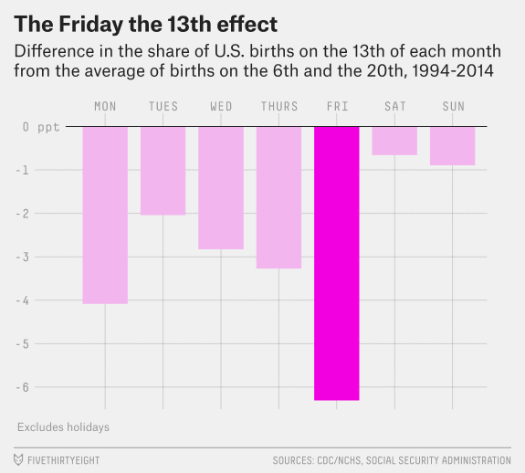
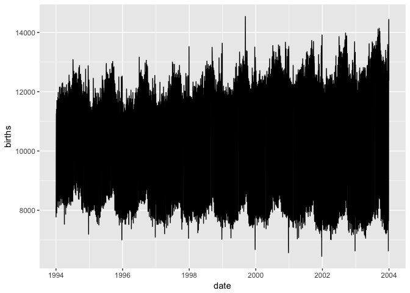
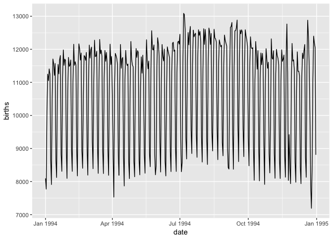
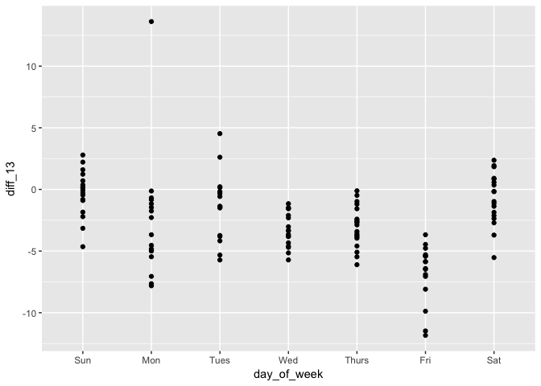
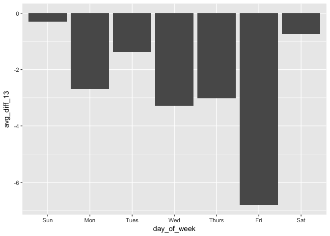

Case Study: Friday the 13th Effect (Solution)
================

<!-- This file by Charlotte Wickham is licensed under a Creative Commons Attribution 4.0 International License. -->
``` r
library(fivethirtyeight)
library(tidyverse)
```

Task
----

Reproduce this figure from fivethirtyeight's article [*Some People Are Too Superstitious To Have A Baby On Friday The 13th*](https://fivethirtyeight.com/features/some-people-are-too-superstitious-to-have-a-baby-on-friday-the-13th/):



Data
----

In the `fivethiryeight` package there are two datasets containing birth data, but for now let's just work with one `US_births_1994_2003`. Note that since we have data from 1994-2003, our results may differ somewhat from the figure based on 1994-2014.

Your Turn 1
-----------

With your neighbour, brainstorm the steps needed to get the data in a form ready to make the plot.

``` r
US_births_1994_2003
```

    ## # A tibble: 3,652 x 6
    ##     year month date_of_month date       day_of_week births
    ##    <int> <int>         <int> <date>     <ord>        <int>
    ##  1  1994     1             1 1994-01-01 Sat           8096
    ##  2  1994     1             2 1994-01-02 Sun           7772
    ##  3  1994     1             3 1994-01-03 Mon          10142
    ##  4  1994     1             4 1994-01-04 Tues         11248
    ##  5  1994     1             5 1994-01-05 Wed          11053
    ##  6  1994     1             6 1994-01-06 Thurs        11406
    ##  7  1994     1             7 1994-01-07 Fri          11251
    ##  8  1994     1             8 1994-01-08 Sat           8653
    ##  9  1994     1             9 1994-01-09 Sun           7910
    ## 10  1994     1            10 1994-01-10 Mon          10498
    ## # ... with 3,642 more rows

Some overviews of the data
--------------------------

Whole time series:

``` r
ggplot(US_births_1994_2003, aes(x = date, y = births)) +
  geom_line()
```

 There is so much fluctuation it's really hard to see what is going on.

Let's try just looking at one year:

``` r
US_births_1994_2003 %>%
  filter(year == 1994) %>%
  ggplot(mapping = aes(x = date, y = births)) +
    geom_line()
```

 Strong weekly pattern accounts for most variation.

Strategy
--------

Use the figure as a guide for what the data should like to make the final plot. We want to end up with something like:

<table style="width:39%;">
<colgroup>
<col width="19%" />
<col width="19%" />
</colgroup>
<thead>
<tr class="header">
<th align="center">day_of_week</th>
<th align="center">avg_diff_13</th>
</tr>
</thead>
<tbody>
<tr class="odd">
<td align="center">Mon</td>
<td align="center">-2.686</td>
</tr>
<tr class="even">
<td align="center">Tues</td>
<td align="center">-1.378</td>
</tr>
<tr class="odd">
<td align="center">Wed</td>
<td align="center">-3.274</td>
</tr>
<tr class="even">
<td align="center">...</td>
<td align="center">...</td>
</tr>
</tbody>
</table>

There is more than one way to get there, but we ll roughly follow this strategy:

-   Get just the data for the 6th, 13th, and 20th
-   Calculate variable of interest:
    -   (For each month/year):
        -   Find average births on 6th and 20th
        -   Find percentage difference between births on 13th and average births on 6th and 20th
    -   Average percent difference by day of the week
-   Create plot

Your Turn 2
-----------

Extract just the 6th, 13th and 20th of each month:

``` r
US_births_1994_2003 %>%
  select(-date) %>% 
  filter(date_of_month %in% c(6, 13, 20)) 
```

    ## # A tibble: 360 x 5
    ##     year month date_of_month day_of_week births
    ##    <int> <int>         <int> <ord>        <int>
    ##  1  1994     1             6 Thurs        11406
    ##  2  1994     1            13 Thurs        11212
    ##  3  1994     1            20 Thurs        11682
    ##  4  1994     2             6 Sun           8309
    ##  5  1994     2            13 Sun           8171
    ##  6  1994     2            20 Sun           8402
    ##  7  1994     3             6 Sun           8389
    ##  8  1994     3            13 Sun           8248
    ##  9  1994     3            20 Sun           8243
    ## 10  1994     4             6 Wed          11811
    ## # ... with 350 more rows

Your Turn 3
-----------

Which arrangement is tidy?

**Option 1:**

<table style="width:74%;">
<colgroup>
<col width="9%" />
<col width="11%" />
<col width="22%" />
<col width="19%" />
<col width="11%" />
</colgroup>
<thead>
<tr class="header">
<th align="center">year</th>
<th align="center">month</th>
<th align="center">date_of_month</th>
<th align="center">day_of_week</th>
<th align="center">births</th>
</tr>
</thead>
<tbody>
<tr class="odd">
<td align="center">1994</td>
<td align="center">1</td>
<td align="center">6</td>
<td align="center">Thurs</td>
<td align="center">11406</td>
</tr>
<tr class="even">
<td align="center">1994</td>
<td align="center">1</td>
<td align="center">13</td>
<td align="center">Thurs</td>
<td align="center">11212</td>
</tr>
<tr class="odd">
<td align="center">1994</td>
<td align="center">1</td>
<td align="center">20</td>
<td align="center">Thurs</td>
<td align="center">11682</td>
</tr>
</tbody>
</table>

**Option 2:**

<table style="width:74%;">
<colgroup>
<col width="9%" />
<col width="11%" />
<col width="19%" />
<col width="11%" />
<col width="11%" />
<col width="11%" />
</colgroup>
<thead>
<tr class="header">
<th align="center">year</th>
<th align="center">month</th>
<th align="center">day_of_week</th>
<th align="center">6</th>
<th align="center">13</th>
<th align="center">20</th>
</tr>
</thead>
<tbody>
<tr class="odd">
<td align="center">1994</td>
<td align="center">1</td>
<td align="center">Thurs</td>
<td align="center">11406</td>
<td align="center">11212</td>
<td align="center">11682</td>
</tr>
</tbody>
</table>

(**Hint:** think about our next step *"Find the percent difference between the 13th and the average of the 6th and 12th"*. In which layout will this be easier using our tidy tools?)

**Solution**: Option 2, since then we can easily use `mutate()`.

Your Turn 4
-----------

Tidy the filtered data to have the days in columns.

``` r
US_births_1994_2003 %>%
  select(-date) %>% 
  filter(date_of_month %in% c(6, 13, 20)) %>%
  spread(date_of_month, births)
```

    ## # A tibble: 120 x 6
    ##     year month day_of_week   `6`  `13`  `20`
    ##  * <int> <int> <ord>       <int> <int> <int>
    ##  1  1994     1 Thurs       11406 11212 11682
    ##  2  1994     2 Sun          8309  8171  8402
    ##  3  1994     3 Sun          8389  8248  8243
    ##  4  1994     4 Wed         11811 11428 11585
    ##  5  1994     5 Fri         11904 11085 11645
    ##  6  1994     6 Mon         11130 10692 11337
    ##  7  1994     7 Wed         13086 12134 12378
    ##  8  1994     8 Sat          9336  9474  9646
    ##  9  1994     9 Tues        11448 12560 12584
    ## 10  1994    10 Thurs       12017 11398 11876
    ## # ... with 110 more rows

Your Turn 5
-----------

Now use `mutate()` to add columns for:

-   The average of the births on the 6th and 20th
-   The percentage difference between the number of births on the 13th and the average of the 6th and 20th

``` r
US_births_1994_2003 %>%
  select(-date) %>% 
  filter(date_of_month %in% c(6, 13, 20)) %>%
  spread(date_of_month, births) %>%
  mutate(
    avg_6_20 = (`6` + `20`)/2,
    diff_13 = (`13` - avg_6_20) / avg_6_20 * 100
  )
```

    ## # A tibble: 120 x 8
    ##     year month day_of_week   `6`  `13`  `20` avg_6_20 diff_13
    ##    <int> <int> <ord>       <int> <int> <int>    <dbl>   <dbl>
    ##  1  1994     1 Thurs       11406 11212 11682    11544  -2.88 
    ##  2  1994     2 Sun          8309  8171  8402     8356  -2.21 
    ##  3  1994     3 Sun          8389  8248  8243     8316  -0.818
    ##  4  1994     4 Wed         11811 11428 11585    11698  -2.31 
    ##  5  1994     5 Fri         11904 11085 11645    11774  -5.86 
    ##  6  1994     6 Mon         11130 10692 11337    11234  -4.82 
    ##  7  1994     7 Wed         13086 12134 12378    12732  -4.70 
    ##  8  1994     8 Sat          9336  9474  9646     9491  -0.179
    ##  9  1994     9 Tues        11448 12560 12584    12016   4.53 
    ## 10  1994    10 Thurs       12017 11398 11876    11946  -4.59 
    ## # ... with 110 more rows

A little additional exploring
-----------------------------

Now we have a percent difference between the 13th and the 6th and 20th of each month, it's probably worth exploring a little (at the very least to check our calculations seem reasonable).

To make it a little easier let's assign our current data to a variable

``` r
births_diff_13 <- US_births_1994_2003 %>%
  select(-date) %>% 
  filter(date_of_month %in% c(6, 13, 20)) %>%
  spread(date_of_month, births) %>%
  mutate(
    avg_6_20 = (`6` + `20`)/2,
    diff_13 = (`13` - avg_6_20) / avg_6_20 * 100
  )
```

Then take a look

``` r
births_diff_13 %>% 
  ggplot(mapping = aes(day_of_week, diff_13)) +
    geom_point()
```



Looks like we are on the right path. There's a big outlier one Monday

``` r
births_diff_13 %>%
  filter(day_of_week == "Mon", diff_13 > 10)
```

    ## # A tibble: 1 x 8
    ##    year month day_of_week   `6`  `13`  `20` avg_6_20 diff_13
    ##   <int> <int> <ord>       <int> <int> <int>    <dbl>   <dbl>
    ## 1  1999     9 Mon          8249 11481 11961    10105    13.6

Seem's to be driven but a particularly low number of births on the 6th of Sep 1999. Maybe a holiday effect? Labour Day was of the 6th of Sep that year.

Your Turn 6
-----------

Summarize each day of the week to have mean of diff\_13.

Then, recreate the fivethirtyeight plot.

``` r
US_births_1994_2003 %>%
  select(-date) %>% 
  filter(date_of_month %in% c(6, 13, 20)) %>%
  spread(date_of_month, births) %>%
  mutate(
    avg_6_20 = (`6` + `20`)/2,
    diff_13 = (`13` - avg_6_20) / avg_6_20 * 100
  ) %>%
  group_by(day_of_week) %>%
  summarise(avg_diff_13 = mean(diff_13)) %>%
  ggplot(aes(x = day_of_week, y = avg_diff_13)) +
    geom_bar(stat = "identity")
```



Extra Challenges
----------------

-   If you wanted to use the `US_births_2000_2014` data instead, what would you need to change in the pipeline? How about using both `US_births_1994_2003` and `US_births_2000_2014`?

-   Try not removing the `date` column. At what point in the pipeline does it cause problems? Why?

-   Can you come up with an alternative way to investigate the Friday the 13th effect? Try it out!

Takeaways
---------

The power of the tidyverse comes from being able to easily combine functions that do simple things well.
