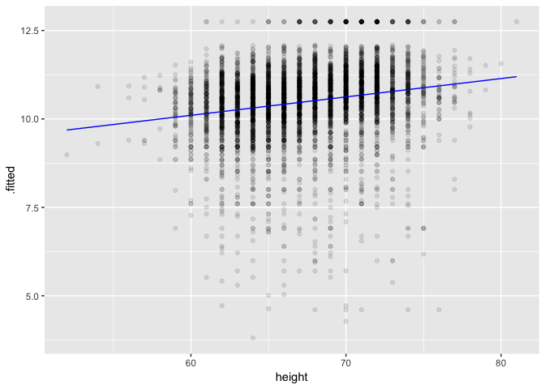
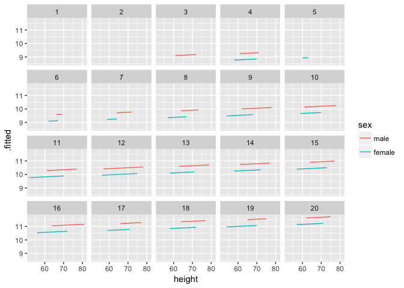
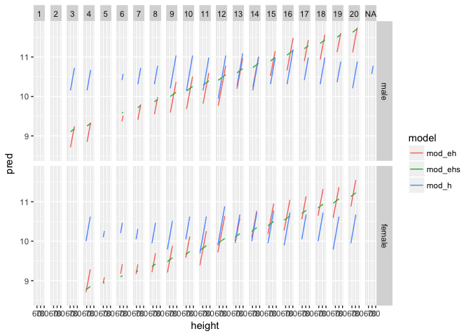

Model (solutions)
================

``` r
library(tidyverse)
library(modelr)
library(broom)
```

    ## Warning: package 'broom' was built under R version 3.4.3

``` r
wages <- heights %>% filter(income > 0)
```

Your Turn 1
-----------

Fit the model on the slide and then examine the output. What does it look like?

``` r
mod_e <- lm(log(income) ~ education, data = wages)
mod_e
```

    ## 
    ## Call:
    ## lm(formula = log(income) ~ education, data = wages)
    ## 
    ## Coefficients:
    ## (Intercept)    education  
    ##      8.5577       0.1418

Your Turn 2
-----------

Use a pipe to model `log(income)` against `height`. Then use broom and dplyr functions to extract:

1.  The **coefficient estimates** and their related statistics
2.  The **adj.r.squared** and **p.value** for the overall model

``` r
mod_h <- wages %>% lm(log(income) ~ height, data = .)
mod_h %>%
  tidy()
```

    ## # A tibble: 2 x 5
    ##   term        estimate std.error statistic                         p.value
    ##   <chr>          <dbl>     <dbl>     <dbl>                           <dbl>
    ## 1 (Intercept)   6.98     0.237        29.4                       4.13e⁻¹⁷⁶
    ## 2 height        0.0520   0.00352      14.8                       2.44e⁻ ⁴⁸

``` r
mod_h %>% 
  glance() %>% 
  select(adj.r.squared, p.value)
```

    ## # A tibble: 1 x 2
    ##   adj.r.squared                                              p.value
    ##           <dbl>                                                <dbl>
    ## 1        0.0396 0.00000000000000000000000000000000000000000000000244

Your Turn 3
-----------

Model `log(income)` against `education` *and* `height`. Do the coefficients change?

``` r
mod_eh <- wages %>% 
  lm(log(income) ~ education + height, data = .)

mod_eh %>% 
  tidy()
```

    ## # A tibble: 3 x 5
    ##   term        estimate std.error statistic                         p.value
    ##   <chr>          <dbl>     <dbl>     <dbl>                           <dbl>
    ## 1 (Intercept)   5.35     0.231        23.1                       1.00e⁻¹¹²
    ## 2 education     0.139    0.00521      26.6                       7.12e⁻¹⁴⁷
    ## 3 height        0.0483   0.00331      14.6                       2.50e⁻ ⁴⁷

Your Turn 4
-----------

Model `log(income)` against `education` and `height` and `sex`. Can you interpret the coefficients?

``` r
mod_ehs <- wages %>% 
  lm(log(income) ~ education + height + sex, data = .)

mod_ehs %>% 
  tidy()
```

    ## # A tibble: 4 x 5
    ##   term        estimate std.error statistic                         p.value
    ##   <chr>          <dbl>     <dbl>     <dbl>                           <dbl>
    ## 1 (Intercept)  8.25      0.335       24.6                        4.68e⁻¹²⁷
    ## 2 education    0.148     0.00520     28.5                        5.16e⁻¹⁶⁶
    ## 3 height       0.00673   0.00479      1.40                       1.61e⁻  ¹
    ## 4 sexfemale   -0.462     0.0389     -11.9                        5.02e⁻ ³²

Your Turn 5
-----------

Use a broom function and ggplot2 to make a line graph of `height` vs `.fitted` for our heights model, `mod_h`.

*Bonus: Overlay the plot on the original data points.*

``` r
mod_h <- wages %>% lm(log(income) ~ height, data = .)

mod_h %>% 
  augment(data = wages) %>% 
  ggplot(mapping = aes(x = height, y = .fitted)) +
    geom_point(mapping = aes(y = log(income)), alpha = 0.1) +
    geom_line(color = "blue")
```



Your Turn 6
-----------

Repeat the process to make a line graph of `height` vs `.fitted` colored by `sex` for model mod\_ehs. Are the results interpretable? Add `+ facet_wrap(~education)` to the end of your code. What happens?

``` r
mod_ehs <- wages %>% lm(log(income) ~ education + height + sex, data = .)

mod_ehs %>% 
  augment(data = wages) %>% 
  ggplot(mapping = aes(x = height, y = .fitted, color = sex)) +
    geom_line() +
    facet_wrap(~ education)
```

    ## geom_path: Each group consists of only one observation. Do you need to
    ## adjust the group aesthetic?
    ## geom_path: Each group consists of only one observation. Do you need to
    ## adjust the group aesthetic?



Your Turn 7
-----------

Use one of `spread_predictions()` or `gather_predictions()` to make a line graph of `height` vs `pred` colored by `model` for each of mod\_h, mod\_eh, and mod\_ehs. Are the results interpretable?

Add `+ facet_grid(sex ~ education)` to the end of your code. What happens?

``` r
mod_h <- wages %>% lm(log(income) ~ height, data = .)
mod_eh <- wages %>% lm(log(income) ~ education + height, data = .)
mod_ehs <- wages %>% lm(log(income) ~ education + height + sex, data = .)

wages %>% 
  gather_predictions(mod_h, mod_eh, mod_ehs) %>% 
  ggplot(mapping = aes(x = height, y = pred, color = model)) +
    geom_line() +
    facet_grid(sex ~ education)
```



------------------------------------------------------------------------

Take Aways
==========

-   Use `glance()`, `tidy()`, and `augment()` from the **broom** package to return model values in a data frame.

-   Use `add_predictions()` or `gather_predictions()` or `spread_predictions()` from the **modelr** package to visualize predictions.

-   Use `add_residuals()` or `gather_residuals()` or `spread_residuals()` from the **modelr** package to visualize residuals.
